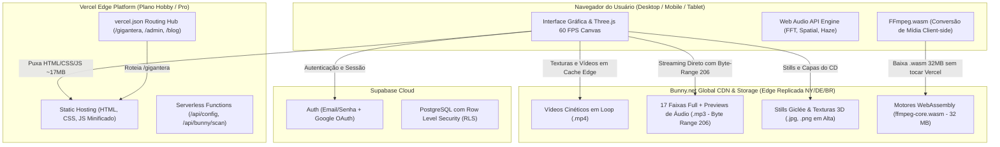

# PELIMOTION — Digital Studio, Creative Direction & Spatial Experiences
> **Repositório Mestre do Ecossistema Pelimotion & Pavilhão Tridimensional Gigantera**  
> Produção: **[pelimotion.art](https://pelimotion.art)** | Pavilhão 3D: **[pelimotion.art/gigantera](https://pelimotion.art/gigantera)**

---

## 🧭 Sumário Executivo para Líderes Técnicos & Diretores Criativos

Bem-vindo ao repositório oficial da **Pelimotion**. Este ecossistema reúne portfólio comercial de alta performance, painel administrativo de gestão de mídia, hub editorial e uma das mais avançadas galerias tridimensionais brutalistas da web contemporânea (**Gigantera**).

Este documento é o guia definitivo para **Engenheiros de Software Sênior**, **Programadores de WebGL/Frontend** e **Diretores de Criação/Design** assumirem, desenvolverem e operarem o projeto com excelência e autonomia total.

---

## 🏛️ Topologia Arquitetural do Ecossistema

O projeto adota uma arquitetura híbrida de **Zero-Bandwidth Origin + Global Media Edge**, garantindo custo mínimo de infraestrutura, velocidade sub-segundo em escala global e conformidade estrita com as cotas da Vercel.



---

## 🗺️ Matriz de Subprojetos e Módulos

| Subprojeto / Rota | Stack Tecnológica | Responsabilidade | Documentação Detalhada |
| :--- | :--- | :--- | :--- |
| **`/` (Raiz)** | HTML5, CSS3 Vanilla, JavaScript Moderno | Landing page principal, portfólio comercial e reel | [`README.md`](./README.md) & [`CLAUDE.md`](./CLAUDE.md) |
| **`/gigantera`** | React 19, TypeScript, Vite, Three.js, Web Audio API, GSAP | Pavilhão brutalista 3D, CD Jewel Case em POV, Modo Loupe e Mobile | [`gigantera/README.md`](./gigantera/README.md) |
| **`/admin`** | HTML5, CSS3, JavaScript Vanilla, Bunny API | Painel de controle de mídia, Deploy Hub, gerador de GIFs via WASM | [`admin/SPEC_01_ADMIN_PANEL_ARCHITECTURE.md`](./admin/SPEC_01_ADMIN_PANEL_ARCHITECTURE.md) |
| **`/blog`** | HTML5 estático gerado proceduralmente | Hub editorial e artigos de motion/design com SEO e RSS | [`blog/`](./blog/) |
| **`/curriculum`** | HTML5 semântico, CSS print-ready | Currículo interativo e exportação de PDF de alta fidelidade | [`Curriculum/`](./Curriculum/) |
| **`/projetos-app`** | React, Tailwind CSS, dnd-kit, Supabase | Gestão de tarefas Kanban, cenas e daily log | [`AGENTS.md`](./AGENTS.md) |

---

## 🎨 Diretrizes para Diretores Criativos & Designers

### 1. Filosofia Visual: Brutalismo Escultural & Espaço Liminar
Gigantera e Pelimotion não são meras vitrines de arquivos, mas uma **instalação espacial imersiva**. O design visual opera na fronteira entre arquitetura bruta de concreto, fósseis tecnológicos e o som tátil analógico:
- **Tipografia Heráldica e Técnica:**
  - `Syne` (800 / Ultra-Bold): Usada para títulos monumentais, declarações curatoriais e números romanos de setor.
  - `Fraunces`: Usada para títulos de obras em itálico de alto contraste, conferindo organicidade arqueológica.
  - `Space Mono` & `Space Grotesk`: Usada para índices de estrato (`[STRATUM // 01]`), coordenadas barométricas, telemetria de FPS e ficha técnica de museu.
- **Dualidade de Ambientes (Obsidiana vs. Alabastro):**
  - **Obsidiana (Dark Noir):** Salão brutalista em concreto escuro, pisos de basalto com reflexos anisotrópicos e luzes douradas emanando de claraboias.
  - **Alabastro (White Cube):** Salão brutalista contemporâneo em gesso, mármore mate e giz, com sombras suaves e claridade etérea.
- **Linguagem Cinematográfica em 3D:**
  - Vitrines translúcidas em vidro óptico suspensas no vazio sem bases pesadas.
  - Molduras com iluminação volumétrica focada que se acendem quando o observador se aproxima.
  - Efeito de distorção de ar (*acoustic heat haze*) emanando das caixas acústicas quando o som está ativo, em vez de vetores wireframe genéricos.

### 2. CD Jewel Case em POV (Acoustic POV Station)
Uma recriação tátil e física de um estojo de acrílico padrão de CD dos anos 90/2000:
- **Mão 3D Facetada em Primeira Pessoa:** Mão angular em cerâmica/gesso (*flat-shaded*) segurando a quina do estojo.
- **Contracapa Dinâmica (Canvas 1024x1024):** Exibe 17 faixas autorais numeradas com título, BPM e código de barras autêntico.
- **Giro Físico de 180° (`[F]`):** Rotação 3D suave entre a contracapa e a arte frontal de Pelimotion.
- **Áudio Adaptativo:** Previews rápidos ao folhear as músicas e upgrade imperceptível para a faixa completa de alta fidelidade após permanência.

---

## 💻 Guia Técnico para Desenvolvedores Sênior

### 1. Instalação & Pré-requisitos
- **Node.js:** Versão 24.x LTS (recomendado via NVM: `nvm use 24`)
- **Python:** 3.10+ (ou gerenciado via `uv`) para automações de deploy e ferramentas de auditoria
- **Gerenciador de Pacotes:** `npm` padrão

```bash
# 1. Clonar repositório
git clone https://github.com/Pelimotion/portfolio.git
cd portfolio

# 2. Instalar dependências do Gigantera
cd gigantera
npm install
cd ..

# 3. Configurar variáveis de ambiente
cp .env.example .env # preencher BUNNY_API_KEY, SUPABASE_URL, etc.
```

### 2. Scripts de Execução e Build
- **Desenvolvimento do Gigantera (HMR Local):**
  ```bash
  cd gigantera
  npm run dev
  # Acesse em http://localhost:5173/gigantera/
  ```
- **Build de Produção do Gigantera:**
  ```bash
  cd gigantera
  npm run build
  # Compila TypeScript, executa Vite build e copia index.source.html e assets para a raiz do subprojeto
  ```
- **Servidor Estático Local da Raiz:**
  ```bash
  npx serve .
  ```

---

## 📦 Estratégia de Mídia & Bunny.net CDN (Regra Anti-Cota Vercel)

> [!IMPORTANT]
> **NUNCA comite arquivos de áudio (.mp3, .wav), vídeos (.mp4) ou binários WebAssembly (.wasm) no repositório Git.**
> A Vercel possui um teto mensal estrito de **10 GB para Fast Origin Transfer** no plano Hobby. Mídias pesadas servidas diretamente da Vercel esgotam a cota e causam suspensão da conta.

### Como Funciona o Pipeline de Mídia:
1. **Vídeos, Stills e Áudios:** São enviados para o Storage Zone da Bunny.net (`pelimotion-portfolio`).
2. **Distribuição Global (Pull Zone):** São servidos via CDN com URL base:
   - `https://pelimotion-portfolio.b-cdn.net/gigantera/audio/full/` (Áudios Integrais)
   - `https://pelimotion-portfolio.b-cdn.net/gigantera/audio/previews/` (Previews 10s)
   - `https://pelimotion-portfolio.b-cdn.net/gigantera/stills/` (Imagens Alta Resolução)
   - `https://pelimotion-portfolio.b-cdn.net/gigantera/videos/` (Vídeos em Loop)
   - `https://pelimotion-portfolio.b-cdn.net/ffmpeg/` (Motor FFmpeg.wasm)
3. **Suporte a Byte-Range Requests (HTTP 206):** A Bunny.net permite que os arquivos de áudio de 8 MB iniciem a reprodução em menos de 50ms, baixando apenas os primeiros blocos e permitindo que o usuário avance a música sem travar o navegador.
4. **Proteção de Deploy:** O arquivo [`.vercelignore`](./.vercelignore) e o [`.gitignore`](./.gitignore) contêm regras estritas que impedem qualquer arquivo pesado de ser enviado para a Vercel. O bundle final de deploy do site completo pesa apenas **~17 MB**.

---

## 🕹️ Arquitetura dos Módulos do Gigantera (`/gigantera/src`)

- **`core/store.ts` (Zustand):**
  - Gerenciamento atômico de estado: coordenadas da câmera, setor ativo (`entrance-audio`, `still`, `video`), tema visual, modo cinema, estado da mão/CD, qualidade gráfica (`light`, `med`, `high`), e controles mobile.
- **`core/playerController.ts`:**
  - Controlador de física em primeira pessoa com aceleração, atrito, limites de colisão do pavilhão, balanço de cabeça (*head bob*), suporte a giroscópio de smartphone e *smooth glide navigation* para dispositivos móveis.
- **`core/soundEngine.ts`:**
  - Web Audio API customizada com `AudioContext`, analisador de frequências FFT de 128 bandas (`analyserNode`), atenuação acústica estéreo proporcional à distância das caixas no salão e curva suave de *crossfade* ao abrir obras em vídeo.
- **`components/canvas/GalleryScene3D.tsx`:**
  - Renderizador principal Three.js com iluminação em tempo real, sombras dinâmicas, partículas volumétricas de poeira e distorção de ar quente nos cones dos alto-falantes.
- **`components/canvas/CDViewmodel3D.ts`:**
  - Viewmodel da mão poligonal com sombreamento facetado e estojo acrílico em primeira pessoa. Renderizado sobreposto à câmera para não sofrer cortes com as paredes do cenário.

---

## 🚀 Deploy & Infraestrutura

- **Deploy Automático:** Todo push na branch `main` no GitHub (`https://github.com/Pelimotion/portfolio.git`) aciona automaticamente a Vercel, que executa o roteamento estático definido em [`vercel.json`](./vercel.json).
- **Roteamento SPA e Subcaminhos:** O `vercel.json` garante que rotas como `/gigantera`, `/admin`, `/blog` e `/curriculum` resolvam diretamente para seus respectivos pontos de entrada estáticos sem loops de redirecionamento.
- **Knowledge Graph Integrado:** O projeto mantém documentação rastreável e grafo de conhecimento vivo em [`graphify-out/`](./graphify-out/), permitindo consultas semânticas sobre todo o código e decisões arquiteturais.

---

*Pelimotion — Creative Engineering & Spatial Art Direction. Documentação mantida e atualizada continuamente.*
