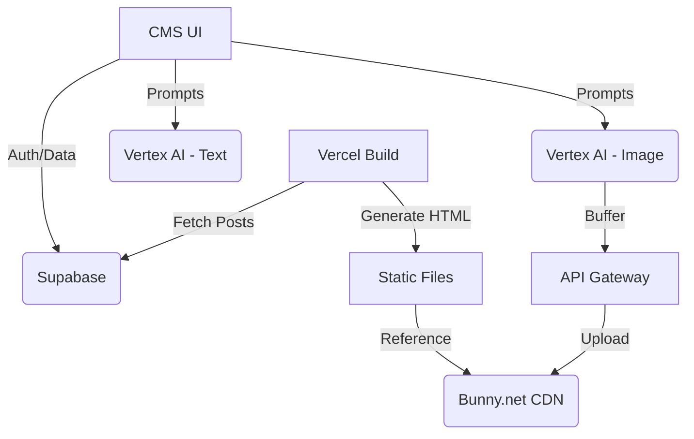

# PELIMOTION STUDIO | PROJECT BLUEPRINT
**Status:** v5.0 (Brutalist Architecture)  
**Objective:** High-performance static blog with AI-automated content generation and advanced asset management.

## 1. CORE PHILOSOPHY
The system is built on the principle of **"Static Frontend, Dynamic Pipeline"**. 
- The user-facing blog is 100% static (HTML/CSS/JS) for maximum SEO and performance.
- The content creation (CMS) is a rich, AI-powered web application that orchestrates multiple APIs.

## 2. TECHNOLOGY STACK
- **Frontend (Blog):** Vanilla HTML/CSS, Marked.js (Markdown parsing), CDN-first assets.
- **CMS:** Brutalist HTML/Vanilla JS, Supabase Client, Vertex AI Integration.
- **Backend:** Vercel Serverless Functions (Node.js).
- **Database:** Supabase (PostgreSQL + JSONB).
- **CDN/Storage:** Bunny.net (Storage & Pull Zone).
- **AI Models:** 
  - Gemini 2.5 Pro (Complex Writing)
  - Gemini 2.5 Flash (Brainstorming/SEO)
  - Imagen 3.0 (Photorealistic Visuals)

## 3. ARCHITECTURAL LAYOUT

## 4. KEY WORKFLOWS
1. **Brainstorming:** AI suggests title, slug, and SEO metadata + Image slots.
2. **Structuring:** AI creates an outline (H2/H3).
3. **Writing:** AI generates long-form content in Markdown.
4. **Visual Sync:** AI analyzes text to generate cohesive visual prompts.
5. **Static Generation:** A Node.js script converts Supabase data into SEO-perfect HTML files during deployment.
