# Notion Workspace Architecture
> Extraído em: 2026-05-21T18:14:44.286Z

## Resumo
| Métrica | Valor |
|---------|-------|
| Databases | 22 |
| Pages | 1210 |
| Relações mapeadas | 4 |

## ⚠️ Database Crítico Não Acessível
O database **"Projetos PLM"** (ID: `3e5c9ec2-779e-4211-a627-813df3778a92`) aparece em 3 relações mas não está compartilhado com a integração. É o **núcleo do sistema de projetos** — conectar este database é prioritário antes da migração.

---

## Diagrama de Entidades (ERD)

```mermaid
erDiagram

    Pipeline_Pelimotion {
        people Pessoa
        formula A_pagar
        number Valor_Total
        date Encerramento
        relation Despesas
        files M_dias
        select Cliente
        multi_select Fornecedores
        number Custo_Pago
        checkbox Entregue
        number Valor_Custo
        formula A_receber
        formula Lucro
        date Pr_xima_Entrega
        date Prox__Pgto
        string _more_7_props_
    }

    Tasks {
        date Data
        select Area
        rich_text Descri__o
        people Atribuir
        checkbox Feito
        status Status
        title Nome
    }

    Saídas {
        number Valor
        title Nome
    }

    Entradas {
        number Valor
        title Nome
    }

    Investimento {
        date Data
        status Area
        rich_text Descri__o
        number Pre_o
        checkbox Feito
        title Nome
    }

    Saídas_2 {
        checkbox Pago
        created_time Criado_em
        date Data_Compet_ncia
        number Dia_do_Vencimento
        checkbox Recorrente
        relation Projetos_PLM
        number Valor
        formula Vencimento
        select Pagamento
        select Tipo
        multi_select rea
        title Name
    }

    Casa {
        checkbox Status
        select Prioridade
        rich_text Anota__es
        select Esfera
        number Pre_o_Est___ML_Saara_
        title Nome__O_que___isso__
        status Area
    }

    Projetos_Pessoais {
        number Valor_Total
        status Status
        date Data
        title Name
    }

    Tasks_Plm {
        date Data
        created_time Criado_em
        checkbox Feito
        rollup Cliente
        relation Projetos_PLM_1
        rollup Projeto
        title Nome
        status Area
    }

    Saúde {
        date Data
        select Esfera
        multi_select Tags
        rich_text Anota__es
        select Tipo
        select Status
        title Nome__O_que___isso__
    }

    Workflow {
        select Respons_vel
        select Status
        rich_text Produto
        rich_text Observa__es_1
        rich_text Observa__es
        select Canal
        rich_text Dura__o
        rich_text Tipo
        select Prioridade
        date Prazo
        title Tarefa
    }

    Workflow_2 {
        select Respons_vel
        select Status
        rich_text Produto
        rich_text Observa__es_1
        rich_text Observa__es
        select Canal
        rich_text Dura__o
        rich_text Tipo
        select Prioridade
        date Prazo
        title Tarefa
    }

    Workflow_3 {
        select Respons_vel
        select Status
        rich_text Produto
        rich_text Observa__es_1
        rich_text Observa__es
        select Canal
        rich_text Dura__o
        rich_text Tipo
        select Prioridade
        date Prazo
        title Tarefa
    }

    Cronograma {
        checkbox Conclu_do
        select Status
        rich_text Descri__o_para_Cliente
        date Data
        number Estimativa__dias_
        title Nome_da_Tarefa
    }

    CRM {
        rich_text Decisor_2
        url Ctt_2
        url Ctt_1
        select Setor_nicho
        url Link_empresa
        number Faturamento
        status Status
        rich_text Decisor_1
        rich_text Principais_Eventos
        phone_number Cel_1
        phone_number Cel_2
        rich_text Principais_Infos
        status Proced_ncia
        title Nome
    }

    Alto_valor_extraido_perplexity {
        rich_text zip
        select country
        rich_text company
        rich_text title
        rich_text fn
        email email
        select st
        rich_text ln
        select ct
        title phone
    }

    NomedaEmpresa-Funcionrios-ReceitaR-Conta {
        rich_text Receita__R__
        rich_text Contato_Principal
        rich_text L_der_Comercial_Gestor
        rich_text Funcion_rios
        rich_text Especialidades
        url Website___Rede_Social
        title Nome_da_Empresa
    }

    Relação_Produtoras_RJ {
        rich_text Endereco
        rich_text Nota
        rich_text Nome
        rich_text Site
        rich_text Bairro
        rich_text Telefone
        multi_select Cidade
        rich_text Votos
        title ID
        rich_text 5
        rich_text 18
        rich_text 11
        select 20
        rich_text 1
        rich_text 7
        string _more_8_props_
    }

    Relação_produtoras_BH {
        rich_text Votos
        rich_text Telefone
        multi_select Cidade
        rich_text Site
        rich_text Endereco
        rich_text Bairro
        rich_text Nota
        rich_text sHeU
        title ID
    }

    Relação_produtoras_SP {
        select Nota
        rich_text Cidade
        rich_text Telefone
        rich_text Votos
        rich_text Site
        rich_text Endere_o
        rich_text Bairro
        rich_text Nome
        title ID
    }

    Produtos {
        formula Creditos
        number Complexidade
        number Dura__o
        title Name
    }

    Caixa_Pelimotion {
        date Vencimento
        relation Projeto
        multi_select rea
        rollup Valor_Total
        title Name
    }

    Pipeline_Pelimotion }o--o{ PROJETOS_PLM_missing : "___Despesas"

    Saídas_2 }o--o{ PROJETOS_PLM_missing : "Projetos_PLM"

    Tasks_Plm }o--o{ PROJETOS_PLM_missing : "Projetos_PLM_1"

    Caixa_Pelimotion }o--o{ PROJETOS_PLM_missing : "Projeto"
```


## Diagrama por Domínio

```mermaid
graph TB
    subgraph PLM["🎬 DOMÍNIO PELIMOTION"]
        Pipeline_Pelimotion["📁 Pipeline Pelimotion\n22 props"]
        Entradas["📁 Entradas\n2 props"]
        Tasks_Plm["🦎 Tasks Plm\n8 props"]
        Workflow["📁 Workflow\n11 props"]
        Workflow_2["📁 Workflow\n11 props"]
        Workflow_3["📁 Workflow\n11 props"]
        Cronograma["📁 Cronograma\n6 props"]
        CRM["🈯 CRM\n14 props"]
        Alto_valor_extraido_perplexity["📁 Alto valor extraido perplexity\n10 props"]
        NomedaEmpresa-Funcionrios-ReceitaR-Conta["📁 NomedaEmpresa-Funcionrios-ReceitaR-ContatoPrincipal-WebsiteRedeSocial-Especialidades-LderComercialGestor\n7 props"]
        Relação_Produtoras_RJ["📁 Relação Produtoras RJ\n23 props"]
        Relação_produtoras_BH["📁 Relação produtoras BH\n9 props"]
        Relação_produtoras_SP["📁 Relação produtoras SP\n9 props"]
        Produtos["📁 Produtos\n4 props"]
        Caixa_Pelimotion["📁 Caixa Pelimotion\n5 props"]
    end

    subgraph PESSOAL["👤 DOMÍNIO PESSOAL"]
        Tasks["🎴 Tasks\n7 props"]
        Investimento["🦭 Investimento\n6 props"]
        Saídas_2["☕ Saídas\n12 props"]
        Casa["🏡 Casa\n7 props"]
        Projetos_Pessoais["📿 Projetos Pessoais\n4 props"]
        Saúde["🍡 Saúde\n7 props"]
    end

    %% Relações conhecidas
    Pipeline_Pelimotion -->|"🥗 Despesas"| PROJETOS_PLM_MISSING
    Saídas_2 -->|"Projetos PLM"| PROJETOS_PLM_MISSING
    Tasks_Plm -->|"Projetos PLM 1"| PROJETOS_PLM_MISSING
    Caixa_Pelimotion -->|"Projeto"| PROJETOS_PLM_MISSING

    PROJETOS_PLM_MISSING(["⚠️ Projetos PLM\nnão acessível"])
```




---

## Databases por Domínio

### 🎬 Pelimotion (Empresa/B2B)
| Database | Props | Função |
|----------|-------|--------|
| Pipeline Pelimotion | 22 | Core de projetos/pipeline comercial |
| Tasks Plm | 8 | Tarefas de produção (relação com Projetos) |
| Caixa Pelimotion | 5 | Fluxo de caixa empresarial |
| CRM | 14 | Relacionamento com clientes (prospects/ativos) |
| Workflow (×3) | 11 | Fluxo de produção — **3 duplicatas a consolidar** |
| Cronograma | 6 | Cronograma de etapas por projeto |
| Produtos | 4 | Catálogo de serviços/produtos |
| Saídas (simples) | 2 | Registro simples de saídas (legado?) |
| Entradas | 2 | Registro simples de entradas (legado?) |
| Relação Produtoras BH/RJ/SP | 9–23 | Diretórios de fornecedores por cidade |
| Empresas (nome longo) | 7 | Lista de empresas prospects |
| Alto valor Perplexity | 10 | Leads extraídos via IA |

### 👤 Pessoal
| Database | Props | Função |
|----------|-------|--------|
| Tasks | 7 | Tarefas pessoais |
| Saídas (☕) | 12 | Controle de gastos pessoais (fórmulas avançadas) |
| Investimento | 6 | Controle de investimentos |
| Casa | 7 | Lista de necessidades/melhorias domésticas |
| Saúde | 7 | Diário de saúde (sintomas, tratamentos) |
| Projetos Pessoais | 4 | Projetos pessoais em andamento |
